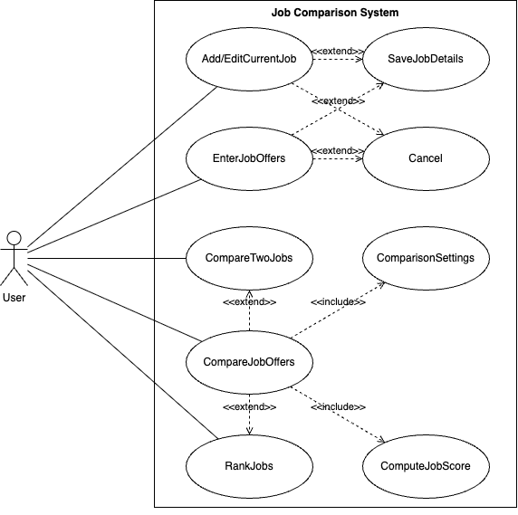

\# Use Case Model

\*\*Author\*\*:Team 113

\#\# 1 Use Case Diagram  

\#\# 2 Use Case Descriptions

**Add/EditCurrentJob**  
\- Requirements: The user is shown a user interface to enter (if it is the first time) or edit all the details of their current job.

\- Pre-conditions: 

* The user is shown a user interface to enter or edit the current job details

\- Post-conditions:

* The user is able to either save the job details or cancel and exit without saving, returning in both cases to the main menu.

\- Scenarios: 

1. The user is on the main menu  
2. Choose to enter or edit the current job details  
3. Save the details or canel  
4. Go back to the main menu

**EnterJobOffers**  
\- Requirements: The user is shown a user interface to enter a new job offer or edit all the details of an existing job offer.

\- Pre-conditions: 

* The user is shown a user interface to enter or edit job offer details 

\- Post-conditions:

* The user is able to either save the job details or cancel and exit without saving  
* The user is able to enter another offer or return to the main menu or compare offers if requirements are satisfied

\- Scenarios: 

1. The user is on the main menu  
2. Choose to enter job offers  
3. Save the details or canel  
4. The user is given the options of add another offer or return back to main menu or compare offer with current job

**SaveJobDetails**  
\- Requirements: Allow the user to save the updated job information

\- Pre-conditions: 

* The user is editing the current job or a job offer

\- Post-conditions:

* Check if the user fills out all the needed information  
* If finished, save the updated information 

\- Scenarios: 

1. The user is entering the current job or a job offer  
2. The user finishes every field  
3. The system saves the information and redirects the user to the main menu

**Cancel**  
\- Requirements: Allow the user to cancel the edit without saving and redirect the user to the main menu

\- Pre-conditions: 

* The user is editing the current job or a job offer

\- Post-conditions:

* Return back to the main menu without saving

\- Scenarios: 

1. The user is entering the current job or a job offer  
2. The user cancels the editing   
3. The system drops the information and redirects the user to the main menu

**ComparisonSettings**  
\- Requirements: Allow the user to optionally adjust integer weights for different attributes before triggering the comparison:

\- Pre-conditions

* Default value for all weights: 1  
* These factors which the user put in should be integer-based from 0 (no interest/don’t care) to 9 (highest interest).

\- Post-conditions:

* If no weights are assigned, all factors are considered equal.  
* The user must be able to either save the comparison settings or cancel. Both options will return the user to the main menu.

\- Scenarios: 

1. The user is on the main menu  
2. Choose to adjust comparison settings  
3. The user will be shown 5 attributes to edit with default value of 1  
4. After editing the user could choose to save or cancel   
5. Return to the main menu interface  
   

**ComputeJobScore**  
\- Requirements: Allow the user to compute a job’s score based on 5 weighted factors

\- Pre-conditions

* AYS, AYB, RA, WS, DI have valid values for each job  
* All five attribute weights have valid integer values.

\- Post-conditions:

* The score value of each job is saved in a hashmap, with each job as the key and its responding score as the value

\- Scenarios: 

1. Check the values of the 5 attributes and the associated weight value  
2. Calculate the weighted average  
3. Save the score value in the hashmap

**CompareJobOffers**  
\- Requirements: Allow the user to compare job offers with current job in 2 ways:

* RankJobs: rank jobs based on the computed job score  
* CompareTwoJobs: compare 2 jobs side by side

\- Pre-conditions: One of these 2 conditions must be met:

* At least two jobs, in case there is no current job  
* At least one job offer, in case there is a current job

\- Post-conditions:

* The user is able to rank and review the job list  
* The user is able to compare 2 jobs and review the job table

\- Scenarios: 

1. The user is on the main menu  
2. Choose to compare job offers  
3. The user will be given the option to adjust the comparison settings and either save or cancel  
4. Job scores will be calculated for the jobs  
5. The user will be shown a list of ranked jobs  
6. The user will select two jobs to trigger the comparison, a table will be shown  
7. The user will be offered to perform another comparison or go back to the main menu

**RankJobs**  
\- Requirements: Allow the user to review the ranked job list

\- Pre-conditions: 

* Comparison settings have been configured  
* Job score computation has been completed

\- Post-conditions:

* The user is able to review the job list, ranked from best to worst

\- Scenarios: 

1. The job score is calculated for each job in the job list  
2. Jobs are ranked from best to worst  
3. Display the outcome  
   

**CompareTwoJobs**  
\- Requirements: Allow the user to select 2 jobs and trigger the comparison, the user will be shown a table for the comparison outcome

\- Pre-conditions: 

* Check if there are enough jobs in the job list  
* Check if any job has missing information

\- Post-conditions:

* Display a table for 2 selected jobs

\- Scenarios: 

1. The user selected 2 jobs from the job list  
2. Trigger the comparison  
3. Display the outcome

